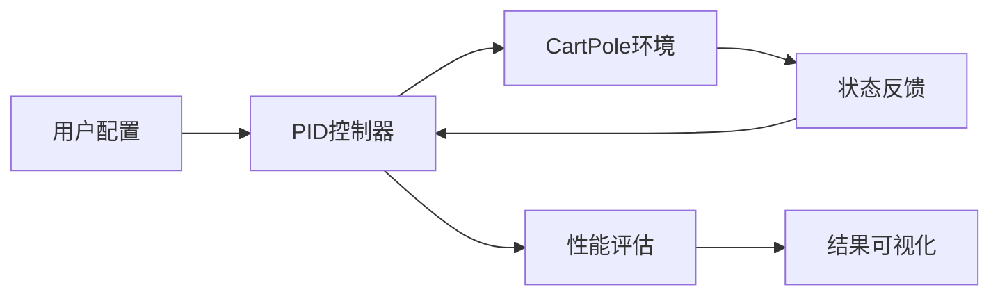
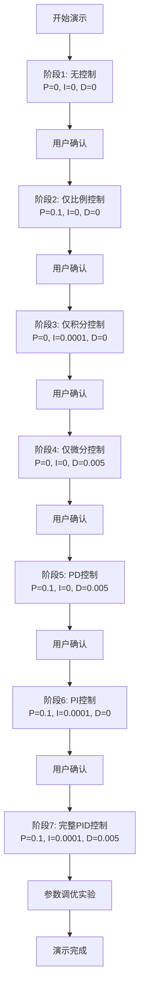
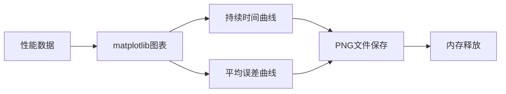

# CartPole PID控制系统

## 1. 项目概述

### 1.1 项目背景
CartPole PID控制系统是一个基于经典控制理论的智能控制系统演示项目，旨在通过实际案例展示PID控制器在倒立摆平衡控制中的应用。该项目作为强化学习与控制理论对比教学的核心组件，帮助学习者理解传统控制方法与现代强化学习算法的区别。

### 1.2 项目目标
- 实现基于PID控制理论的CartPole平衡控制系统
- 提供渐进式PID参数学习演示，从单一参数到完整PID组合
- 建立控制性能评估体系，包括稳定性、响应速度、误差控制等指标
- 为后续强化学习算法对比提供基准性能数据

### 1.3 技术特点
- **实时控制**: 基于物理反馈的实时PID控制算法
- **参数调优**: 系统化的PID参数调优实验框架
- **可视化演示**: 交互式控制效果可视化展示
- **性能分析**: 多维度控制性能评估与数据记录

## 2. 系统架构设计

### 2.1 整体架构



**核心设计理念**: 基于反馈控制的闭环系统，PID控制器根据环境状态实时调整控制策略，实现杆子平衡控制。

### 2.2 Gymnasium环境背景

#### 2.2.1 Gymnasium发展历史
Gymnasium是OpenAI Gym的继任者，是一个用于开发和比较强化学习算法的标准工具包。它的发展历程反映了强化学习领域的快速演进：

- **2016年**: OpenAI发布Gym，为强化学习研究提供标准化环境
- **2020年**: OpenAI将Gym维护权移交给社区
- **2021年**: Gymnasium项目启动，作为Gym的现代化继任者
- **2022年**: Gymnasium正式发布，提供更好的维护和扩展性

#### 2.2.2 设计理念与优势
Gymnasium继承了Gym的核心设计理念，同时解决了原版本的多个问题：

**核心特性**:
- **标准化接口**: 统一的`step()`, `reset()`, `render()`接口
- **环境封装**: 将复杂物理仿真封装为简单的Python对象
- **可扩展性**: 支持自定义环境和新算法集成
- **跨平台兼容**: 支持多种操作系统和Python版本

**技术优势**:
- **性能优化**: 更高效的环境管理和内存使用
- **错误处理**: 改进的异常处理和调试信息
- **文档完善**: 详细的API文档和示例代码
- **社区支持**: 活跃的开源社区和持续更新

#### 2.2.3 生态系统与影响
Gymnasium已经成为强化学习研究和教育的事实标准：

**学术影响**:
- 被数千篇学术论文引用
- 成为强化学习课程的标准工具
- 支持多种主流强化学习框架（Stable Baselines3, RLlib等）

**工业应用**:
- 机器人控制算法开发
- 自动驾驶策略验证
- 游戏AI算法测试
- 控制系统性能评估

#### 2.2.4 CartPole环境的技术意义
CartPole作为Gymnasium的经典环境，具有重要的教学和研究价值：

**物理模型**:
- **倒立摆系统**: 经典的欠驱动非线性系统
- **控制挑战**: 需要实时平衡控制，对控制算法要求高
- **参数敏感性**: 对PID参数变化敏感，适合参数调优学习

**教学价值**:
- **直观性**: 控制效果可视化，便于理解控制原理
- **对比性**: 可以对比传统控制方法与现代强化学习
- **渐进性**: 支持从简单到复杂的控制策略学习

**研究价值**:
- **基准测试**: 作为控制算法性能的标准化测试
- **算法验证**: 验证新控制算法的有效性
- **参数优化**: 研究PID参数调优的自动化方法

### 2.3 核心模块设计

#### 2.3.1 PID控制器模块
- **功能**: 实现经典PID控制算法
- **输入**: 系统状态观测值（位置、速度、角度、角速度）
- **输出**: 控制动作（左推/右推）
- **算法**: 基于误差反馈的PID控制律

#### 2.3.2 环境管理模块
- **功能**: 管理CartPole仿真环境
- **特性**: 支持CartPole-v0/v1环境切换
- **配置**: 可配置的渲染模式和步数限制

#### 2.3.3 实验管理模块
- **功能**: 管理多阶段PID参数实验
- **流程**: 7阶段渐进式参数学习
- **交互**: 用户控制的阶段切换

#### 2.3.4 性能评估模块
- **功能**: 实时计算控制性能指标
- **指标**: 持续时间、角度误差、控制信号强度
- **分析**: 统计分析和趋势识别

## 3. 技术实现细节

### 3.1 PID控制算法实现

#### 3.1.1 控制律设计
```python
# PID控制信号计算
control_signal = (pole_angle * p +           # 比例项：角度偏差响应
                  cart_pos * i +             # 积分项：位置偏差累积
                  pole_angular_vel * d +     # 微分项：角速度响应
                  cart_vel * i)              # 位置反馈项
```

#### 3.1.2 参数作用机制
- **P参数（比例）**: 控制角度偏差的响应强度，值越大响应越快但可能引起振荡
- **I参数（积分）**: 消除稳态误差，累积位置偏差的影响
- **D参数（微分）**: 预测性控制，减少振荡，提高系统稳定性

#### 3.1.3 动作决策逻辑
```python
# 基于控制信号符号的二元动作决策
if control_signal > 0:
    action = 1  # 向右推
else:
    action = 0  # 向左推
```

### 3.2 Gymnasium环境适配策略

#### 3.2.1 环境版本选择
```python
# 优先使用CartPole-v0（200步限制）
try:
    env = gym.make('CartPole-v0', render_mode='human' if render else None)
    print("✅ 使用CartPole-v0环境 (200步限制)")
except:
    # 备选CartPole-v1（500步限制）
    env = gym.make('CartPole-v1', render_mode='human' if render else None)
```

#### 3.2.2 CartPole环境特性详解

**CartPole-v0 (经典版本)**:
- **步数限制**: 200步（更严格的性能要求）
- **终止条件**: 
  - 杆子角度超过±12°（约±0.2095弧度）
  - 小车位置超过±2.4单位
- **奖励机制**: 每步+1，掉入洞中或超出边界为0
- **观测空间**: 4维连续空间 [位置, 速度, 角度, 角速度]
  - 位置范围: [-4.8, 4.8]（观测范围），终止范围: [-2.4, 2.4]
  - 速度范围: [-∞, +∞]
  - 角度范围: [-0.418, 0.418] 弧度（约±24°，观测范围），终止范围: [-0.2095, 0.2095]（约±12°）
  - 角速度范围: [-∞, +∞]
- **动作空间**: 2维离散空间 {0: 左推, 1: 右推}
- **物理参数**: 
  - 小车质量: 1.0 kg
  - 杆子质量: 0.1 kg
  - 杆子长度: 0.5 m
  - 重力加速度: 9.8 m/s²

**CartPole-v1 (扩展版本)**:
- **步数限制**: 500步（相对宽松的性能要求）
- **其他特性**: 与v0完全相同
- **设计目的**: 为更复杂的控制算法提供更长的测试时间

**官方文档参考**: [Gymnasium CartPole环境文档](https://gymnasium.farama.org/environments/classic_control/cart_pole/)

#### 3.2.3 环境内部实现原理

**物理仿真引擎**:
- **数值积分**: 使用Runge-Kutta方法求解微分方程
- **约束处理**: 通过拉格朗日乘数法处理物理约束
- **碰撞检测**: 实时检测小车与边界、杆子与地面的碰撞

**状态空间设计**:
```python
# 观测值的物理含义（基于官方文档）
observation = [
    cart_pos,        # 小车位置 (m) - 观测范围[-4.8, 4.8]，终止范围[-2.4, 2.4]
    cart_vel,        # 小车速度 (m/s) - 无限制
    pole_angle,      # 杆子角度 (rad) - 观测范围[-0.418, 0.418]，终止范围[-0.2095, 0.2095]
    pole_angular_vel # 杆子角速度 (rad/s) - 无限制
]
```

**动作执行机制**:
- **力控制**: 动作0/1对应向左/右施加固定大小的力
- **力的大小**: 10.0 N（牛顿）
- **作用时间**: 每个时间步持续0.02秒
- **累积效应**: 力的作用会累积影响小车和杆子的运动
- **能量依赖**: 推车所需的能量取决于杆子的角度，杆子重心位置影响移动难度

**起始状态**:
- **随机初始化**: 所有观测值在(-0.05, 0.05)范围内均匀随机分布
- **可配置范围**: 通过reset()的options参数可调整初始化范围
- **稳定性**: 起始状态接近平衡点，便于控制算法学习

#### 3.2.4 步数限制处理策略

**环境限制机制**:
- **CartPole-v0**: 200步限制，更严格的性能要求
- **CartPole-v1**: 500步限制，相对宽松的性能要求
- **终止条件**: 区分杆子倒下（terminated）和环境限制（truncated）

**性能评估标准**:
```python
# 基于步数限制的成功率计算
success_rate = np.sum(episode_durations >= 500) / episodes * 100

# 对于CartPole-v0，200步即为满分
# 对于CartPole-v1，500步为满分
```

**环境选择策略**:
- **教学用途**: 优先使用CartPole-v0，步数限制更严格，能更好地展示PID控制的性能差异
- **研究用途**: 可选择CartPole-v1，提供更长的观察时间，适合复杂控制策略的验证
- **性能对比**: 两个环境可以相互对比，验证控制算法的鲁棒性

**奖励函数设计**:
- **标准奖励**: 每步+1，包括终止步
- **Sutton-Barto奖励**: 可通过`sutton_barto_reward=True`启用，非终止步为0，终止步为-1
- **阈值设计**: v0为200，v1为500，基于环境的时间限制

### 3.3 数据记录与内存管理

#### 3.3.1 历史记录限制
```python
# 防止内存泄漏的历史记录大小限制
control_signals = []
angle_errors = []

# 记录数据用于分析（限制历史记录大小）
control_signals.append(control_signal)
```

#### 3.3.2 数据类型一致性
```python
# 确保数据类型一致性，避免计算错误
episode_durations = np.array(episode_durations)
episode_errors = np.array(episode_errors)
```

## 4. 接口设计

### 4.1 核心函数接口

#### 4.1.1 run_pid_control函数
```python
def run_pid_control(episodes=10, render=True, save_data=True, 
                   p=0.1, i=0.0001, d=0.005, 
                   experiment_title="PID控制实验"):
    """
    主要控制函数接口
    
    参数:
        episodes: 运行回合数
        render: 是否显示可视化界面
        save_data: 是否保存性能数据
        p: 比例参数
        i: 积分参数
        d: 微分参数
        experiment_title: 实验主题标题
    
    返回:
        episode_durations: 每回合持续时间数组
        episode_errors: 每回合平均误差数组
    """
```

#### 4.1.2 save_pid_results函数
```python
def save_pid_results(durations, errors, p, i, d):
    """
    结果保存与可视化函数
    
    参数:
        durations: 持续时间数据
        errors: 误差数据
        p, i, d: PID参数
    """
```

#### 4.1.3 tune_pid_parameters函数
```python
def tune_pid_parameters():
    """
    PID参数调优实验函数
    
    功能:
        - 测试多种PID参数组合
        - 自动评估控制性能
        - 推荐最佳参数组合
    """
```

### 4.2 数据接口规范

#### 4.2.1 输入数据格式
- **观测值**: numpy数组，包含4个元素 [cart_pos, cart_vel, pole_angle, pole_angular_vel]
- **PID参数**: 浮点数，范围建议 P∈[0.01, 0.5], I∈[0.0001, 0.001], D∈[0.001, 0.02]

#### 4.2.2 输出数据格式
- **控制动作**: 整数，0表示左推，1表示右推
- **性能数据**: numpy数组，包含持续时间、误差等指标

## 5. 性能指标与评估体系

### 5.1 核心性能指标

#### 5.1.1 稳定性指标
- **持续时间**: 杆子保持平衡的步数
- **成功率**: 达到目标步数的回合比例
- **振荡幅度**: 控制信号的波动范围

#### 5.1.2 精度指标
- **角度误差**: 杆子角度与目标角度的偏差
- **位置误差**: 小车位置与目标位置的偏差
- **平均误差**: 整个回合的平均误差水平

#### 5.1.3 响应性指标
- **响应时间**: 从扰动到恢复平衡的时间
- **超调量**: 控制过程中的最大偏差
- **稳态误差**: 稳定状态下的残余误差

### 5.2 评估算法

#### 5.2.1 统计分析方法
```python
# 性能统计计算
avg_duration = np.mean(episode_durations)
avg_error = np.mean(episode_errors)
success_rate = np.sum(episode_durations >= 500) / episodes * 100
```

#### 5.2.2 趋势分析方法
- **移动平均**: 100回合窗口的移动平均奖励
- **成功率曲线**: 累积成功率的变化趋势
- **误差分布**: 误差值的分布特征分析

## 6. 实验设计

### 6.1 渐进式学习实验

#### 6.1.1 实验阶段设计


1. **阶段1**: 无控制 (P=0, I=0, D=0) - 基准性能
2. **阶段2**: 仅比例控制 (P=0.1, I=0, D=0) - 基本响应
3. **阶段3**: 仅积分控制 (P=0, I=0.0001, D=0) - 稳态误差消除
4. **阶段4**: 仅微分控制 (P=0, I=0, D=0.005) - 振荡抑制
5. **阶段5**: PD控制 (P=0.1, I=0, D=0.005) - 稳定性改善
6. **阶段6**: PI控制 (P=0.1, I=0.0001, D=0) - 精度提升
7. **阶段7**: 完整PID控制 (P=0.1, I=0.0001, D=0.005) - 最优性能

#### 6.1.2 实验流程控制
- **用户交互**: 每个阶段完成后等待用户确认
- **自动切换**: 基于环境状态的自动阶段切换
- **数据记录**: 每个阶段的完整性能数据记录

### 6.2 参数调优实验

#### 6.2.1 参数空间设计
```python
param_sets = [
    {'p': 0.1, 'i': 0.0001, 'd': 0.005, 'name': '参考参数'},
    {'p': 0.15, 'i': 0.0001, 'd': 0.005, 'name': '增大P'},
    {'p': 0.1, 'i': 0.0005, 'd': 0.005, 'name': '增大I'},
    {'p': 0.1, 'i': 0.0001, 'd': 0.01, 'name': '增大D'},
    {'p': 0.05, 'i': 0.0001, 'd': 0.005, 'name': '减小P'},
]
```

#### 6.2.2 性能评估标准
- **主要指标**: 平均持续时间（越长越好）
- **次要指标**: 平均误差（越小越好）
- **综合评分**: 基于多指标的加权评估

## 7. 可视化与用户界面

### 7.1 实时可视化

#### 7.1.1 环境渲染
- **CartPole动画**: 实时显示小车和杆子的运动状态
- **窗口标题**: 通过pygame.display.set_caption设置，显示当前实验主题和PID参数
- **渲染控制**: 可调节的显示速度（time.sleep(0.01)）

#### 7.1.2 控制信息显示
- **实时状态**: 每100步显示当前控制状态
- **参数信息**: 实时显示PID参数和控制信号
- **进度指示**: 清晰的实验阶段和回合进度

### 7.2 结果可视化

#### 7.2.1 图表生成


- **持续时间曲线**: 显示每回合的持续时间变化
- **误差曲线**: 显示每回合的平均误差变化
- **性能对比**: 不同参数组合的性能对比

#### 7.2.2 数据导出
- **图表保存**: 自动保存PNG格式的结果图表
- **数据记录**: 完整的实验数据记录
- **结果总结**: 结构化的实验结果总结

## 8. 错误处理与容错机制

### 8.1 输入验证

#### 8.1.1 参数验证
```python
# 参数类型和范围验证
if episodes <= 0:
    print("❌ 回合数必须大于0")
    return [], []

if not isinstance(episodes, int):
    print("❌ 回合数必须是整数")
    return [], []
```

#### 8.1.2 环境创建容错
```python
try:
    env = gym.make('CartPole-v0', render_mode='human' if render else None)
except Exception as e:
    print(f"❌ 创建环境失败: {e}")
    return [], []
```

### 8.2 运行时错误处理

#### 8.2.1 环境异常处理
- **环境重置失败**: 自动重试机制
- **渲染错误**: 降级到无渲染模式
- **数据保存失败**: 多路径保存尝试

#### 8.2.2 数据异常处理
- **数值异常**: 自动数据清理和验证
- **内存不足**: 自动清理历史记录
- **文件IO错误**: 错误日志记录和恢复

## 9. 性能优化

### 9.1 计算优化

#### 9.1.1 算法优化
- **向量化计算**: 使用numpy进行批量计算
- **内存管理**: 限制历史记录大小，防止内存泄漏
- **缓存机制**: 缓存重复计算结果

#### 9.1.2 渲染优化
- **帧率控制**: 可调节的渲染帧率
- **异步渲染**: 非阻塞的渲染更新
- **资源管理**: 及时释放图形资源

### 9.2 内存优化

#### 9.2.1 数据结构优化
```python
# 限制历史记录大小
control_signals = []
angle_errors = []

# 记录数据用于分析（限制历史记录大小）
control_signals.append(control_signal)
```

#### 9.2.2 垃圾回收
- **及时清理**: 回合结束后清理临时数据
- **图表释放**: 保存后立即关闭matplotlib图表
- **环境重置**: 正确关闭gymnasium环境

## 10. 测试与验证

### 10.1 单元测试

#### 10.1.1 函数测试
- **参数验证**: 测试各种边界条件和异常输入
- **返回值**: 验证函数返回值的正确性
- **副作用**: 检查函数是否产生预期副作用

#### 10.1.2 算法测试
- **PID计算**: 验证PID控制算法的正确性
- **动作决策**: 测试动作选择逻辑的合理性
- **性能计算**: 验证性能指标计算的准确性

### 10.2 集成测试

#### 10.2.1 端到端测试
- **完整流程**: 测试从实验开始到结果生成的完整流程
- **环境交互**: 验证与CartPole环境的正确交互
- **数据流**: 测试数据在各个模块间的正确传递

#### 10.2.2 性能测试
- **响应时间**: 测试系统响应时间是否满足要求
- **资源使用**: 监控内存和CPU使用情况
- **稳定性**: 长时间运行的稳定性测试

## 11. 部署与维护

### 11.1 环境要求

#### 11.1.1 软件依赖
```
gymnasium>=0.29.0
numpy>=1.21.0
matplotlib>=3.5.0
pygame>=2.0.0 (可选，用于窗口标题设置)
```

#### 11.1.2 硬件要求
- **CPU**: 支持浮点运算的现代处理器
- **内存**: 建议4GB以上可用内存
- **显卡**: 支持OpenGL的显卡（用于可视化）

### 11.2 安装部署

#### 11.2.1 环境配置
```bash
# 创建虚拟环境
python -m venv cartpole_pid_env
source cartpole_pid_env/bin/activate  # Linux/Mac
# 或
cartpole_pid_env\Scripts\activate     # Windows

# 安装依赖
pip install -r requirements.txt
```

#### 11.2.2 运行配置
```bash
# 直接运行演示
python cartpole_pid.py

# 作为模块导入
python -c "import cartpole_pid; cartpole_pid.run_pid_control()"
```