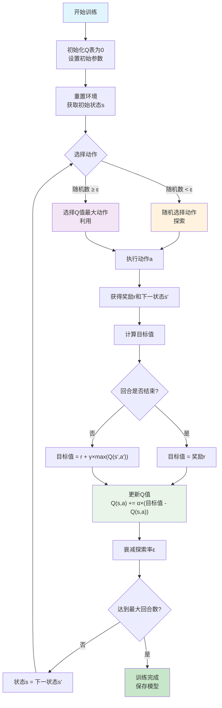
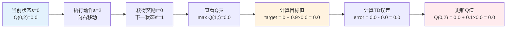
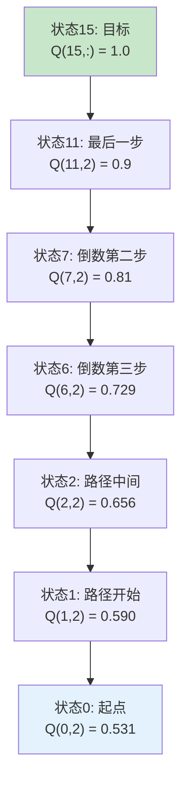

# 第2章 第1课：Q-Learning强化学习算法

## 概述
本课程演示了Q-Learning强化学习算法在FrozenLake（冰冻湖）环境中的应用，展示了从基础实现到优化版本的完整学习过程。

## Q-Learning算法详解

### 核心思想
Q-Learning是一种**无模型**的强化学习算法，通过**试错学习**来找到最优策略。它不需要知道环境的转移概率，只需要通过与环境交互来学习每个状态-动作对的价值。

### 关键概念

#### 1. Q值 (Q-Value)
Q值表示在状态s下执行动作a的**长期期望奖励**：
- **Q(s,a)** = 从状态s执行动作a开始，遵循最优策略能获得的总奖励
- Q值越大，说明该动作在该状态下越有价值

#### 2. 贝尔曼方程
Q-Learning使用贝尔曼方程来更新Q值：

**Q(s,a) ← Q(s,a) + α[r + γ·max(Q(s',a')) - Q(s,a)]**

这个公式的含义：
- **当前Q值** + **学习率** × **时序差分误差**
- **时序差分误差** = **目标值** - **当前Q值**
- **目标值** = **即时奖励** + **折扣因子** × **下一状态最大Q值**

#### 3. 参数详解
- **α (alpha, 学习率)**：控制学习速度，范围[0,1]
  - 接近1：快速学习，但可能不稳定
  - 接近0：稳定学习，但速度慢
- **γ (gamma, 折扣因子)**：未来奖励的重要性，范围[0,1]
  - 接近1：重视长期奖励
  - 接近0：只关注即时奖励
- **r (reward)**：执行动作后获得的即时奖励
- **s, s'**：当前状态和下一状态
- **a, a'**：当前动作和下一动作

### 算法流程

#### 1. 初始化
```python
# 创建Q表，初始化为0
Q_table = np.zeros((state_size, action_size))
epsilon = 1.0  # 初始探索率
```

#### 2. 动作选择 (ε-贪婪策略)
```python
if random() < epsilon:
    action = random_action()  # 探索：随机选择
else:
    action = argmax(Q_table[state])  # 利用：选择最优动作
```

#### 3. Q值更新
```python
# 执行动作，获得奖励和下一状态
next_state, reward, done = env.step(action)

# 计算目标值
if done:
    target = reward  # 回合结束
else:
    target = reward + gamma * max(Q_table[next_state])

# 更新Q值
Q_table[state, action] += alpha * (target - Q_table[state, action])
```

#### 4. 探索率衰减
```python
epsilon = max(epsilon_min, epsilon * epsilon_decay)
```

### Q-Learning工作流程图



### 关键决策点说明

#### 1. 动作选择策略
- **探索阶段**：随机选择动作，发现新的状态-动作组合
- **利用阶段**：选择当前认为最优的动作，利用已有知识

#### 2. Q值更新机制
- **时序差分学习**：使用当前估计和下一状态估计的差异来更新
- **贝尔曼最优性**：确保Q值收敛到最优值

#### 3. 探索率衰减
- **初期高探索**：充分探索环境，发现有效策略
- **后期高利用**：利用学到的知识，提高性能

### 算法特点

#### 优势
- **无模型**：不需要环境模型，只需与环境交互
- **在线学习**：可以边学习边决策
- **收敛保证**：在满足条件下能收敛到最优策略
- **简单易懂**：算法逻辑清晰，易于实现

#### 挑战
- **状态空间爆炸**：状态数量随维度指数增长
- **探索与利用平衡**：需要合理设置探索策略
- **收敛速度慢**：可能需要大量训练回合
- **稀疏奖励**：奖励信号稀少时学习困难

## FrozenLake环境分析

### 环境描述
FrozenLake是一个经典的网格世界环境：
- **地图**：4x4或8x8的网格
- **状态**：智能体当前位置（0-15或0-63）
- **动作**：上下左右四个方向移动
- **目标**：从起点(S)到达目标(G)，避免掉入冰洞(H)

### 环境挑战

#### 1. 稀疏奖励问题
- **原始奖励**：只有到达目标才获得+1奖励，其他情况都是0
- **问题**：智能体很难学习到有效策略
- **解决方案**：奖励塑造，提供更多反馈信号

#### 2. 滑冰效应
- **滑冰模式**：动作执行有随机性，可能滑向其他方向
- **非滑冰模式**：动作执行确定，更容易学习
- **影响**：滑冰模式大大增加了学习难度

#### 3. 状态空间复杂度
- **4x4地图**：16个状态，相对简单
- **8x8地图**：64个状态，复杂度增加4倍
- **路径长度**：8x8环境需要更多步骤到达目标

### 奖励塑造策略
```python
# 原始奖励：只有成功+1，失败0
if reached_goal:
    reward = 1.0
else:
    reward = 0.0

# 改进的奖励塑造
if reached_goal:
    reward = 1.0  # 成功奖励
elif fell_in_hole:
    reward = -0.1  # 掉洞惩罚
else:
    reward = -0.001  # 步数惩罚，鼓励尽快到达
```

### FrozenLake中的Q-Learning执行示例

#### 环境状态表示
```
4x4 FrozenLake地图：
SFFF    S=起点, F=安全冰面, H=冰洞, G=目标
FHFH
FFFH
HFFG
```

#### 单步执行示例
假设智能体在状态0（起点），Q表初始化为0：

```python
# 初始状态
state = 0  # 起点位置
Q_table = np.zeros((16, 4))  # 16个状态，4个动作
epsilon = 0.3  # 探索率
alpha = 0.1    # 学习率
gamma = 0.9    # 折扣因子

# 步骤1：动作选择
if random() < 0.3:  # 30%概率探索
    action = 2  # 随机选择"右"
else:  # 70%概率利用
    action = np.argmax(Q_table[0])  # 选择Q值最大的动作

# 步骤2：执行动作
next_state, reward, done = env.step(2)  # 向右移动
# 结果：next_state=1, reward=0, done=False

# 步骤3：Q值更新
current_q = Q_table[0, 2]  # 当前Q值 = 0
target = 0 + 0.9 * max(Q_table[1])  # 目标值 = 0 + 0.9 * 0 = 0
Q_table[0, 2] = 0 + 0.1 * (0 - 0)  # 更新后Q值 = 0

# 步骤4：状态转移
state = next_state  # 移动到状态1
```

#### 学习过程可视化
```
回合1: 状态0→1→2→6→7→11→15 (成功!)
Q表更新：
Q(0,2) += 0.1 * (0.9^6 * 1.0 - 0) = 0.053
Q(1,2) += 0.1 * (0.9^5 * 1.0 - 0) = 0.059
...

回合100: 智能体开始学习到有效路径
回合1000: 成功率显著提升
回合5000: 策略基本收敛
```

#### Q值更新过程详解



**TD误差为0的含义：**
- 🚫 **学习停滞**：Q值没有更新，智能体没有学到新知识
- 🔍 **探索阶段**：这是训练初期，智能体还在随机探索
- ⏳ **等待成功**：需要成功到达目标，Q值才会开始传播
- 📊 **无信息更新**：这一步没有提供有价值的学习信号

**对比：有意义的TD误差示例**
```
假设智能体已经成功过一次，Q表有了一些值：
当前Q值: Q(0,2) = 0.1
目标值: target = 0 + 0.9×0.5 = 0.45
TD误差: error = 0.45 - 0.1 = 0.35
更新后: Q(0,2) = 0.1 + 0.1×0.35 = 0.135
```
这个例子中，TD误差为0.35，说明：
- ✅ **有学习发生**：Q值从0.1更新到0.135
- 🎯 **正向反馈**：目标值(0.45) > 当前值(0.1)
- 📈 **价值提升**：这个动作的价值被提高了

#### 成功路径的Q值传播
当智能体成功到达目标时，Q值会沿着路径反向传播：



## 实现方案

### 1. 优化版Q-Learning (`frozenlake_q_learning.py`)
- **环境**：支持4x4和8x8网格世界
- **挑战**：稀疏奖励和状态空间复杂度
- **解决方案**：
  - 多层次奖励塑造系统
  - 自适应探索率衰减
  - 动态学习率调整
  - Q值缓存优化
- **特色**：
  - 详细的Q值更新日志
  - 检查点保存和恢复
  - 训练进度可视化
  - 代码工程最佳实践

### 2. 朴素Q-Learning实现 (`frozenlake_clean_qlearning.py`)
- **设计理念**：CleanRL风格的简洁实现
- **特点**：
  - 面向对象设计，代码结构清晰
  - 专注于展示Q-Learning核心原理
  - 易于理解和扩展
  - 适合教学和学习
- **代码结构**：
  - `QLearningAgent`类：封装智能体逻辑
  - `train_qlearning`函数：训练流程
  - `evaluate_agent`函数：性能评估
  - `plot_training_progress`函数：结果可视化

## 主要特色
- 🧠 详细的Q-learning算法实现
- 📊 逐步决策过程日志
- 🎯 每次更新的贝尔曼方程分解
- 📈 训练进度可视化
- 🎮 交互式训练和测试模式
- 💡 强化学习概念的教育性解释
- 🔧 代码优化和幻数消除
- 📝 中文注释和文档

## 文件说明
- `frozenlake_q_learning.py`：优化版FrozenLake Q-learning，包含奖励塑造和代码优化
- `frozenlake_clean_qlearning.py`：朴素Q-Learning实现，CleanRL风格
- `requirements.txt`：Python依赖包
- `README.md`：项目文档

## 使用方法

### FrozenLake演示
```bash
# 安装依赖
pip install -r requirements.txt

# 运行FrozenLake Q-learning
python frozenlake_q_learning.py
```

### 朴素Q-Learning演示
```bash
# 运行CleanRL风格的Q-Learning
python frozenlake_clean_qlearning.py
```

### 交互模式
所有实现都提供：
1. **快速训练**：无可视化快速学习
2. **可视化训练**：实时环境渲染和日志
3. **测试模式**：评估训练好的策略性能

## 超参数调优

### 核心参数

#### 1. 学习率 (α)
- **作用**：控制Q值更新的步长
- **推荐值**：0.1 - 0.9
- **调优策略**：
  - 高学习率(0.9)：快速学习，适合初期探索
  - 低学习率(0.1)：稳定学习，适合精细调优
  - 动态调整：初期高学习率，后期降低

#### 2. 折扣因子 (γ)
- **作用**：决定未来奖励的重要性
- **推荐值**：0.9 - 0.99
- **选择原则**：
  - 短期任务：0.9
  - 长期任务：0.95-0.99
  - 即时奖励任务：0.8

#### 3. 探索率 (ε)
- **作用**：平衡探索与利用
- **初始值**：1.0（完全随机）
- **衰减策略**：
  - 线性衰减：ε = max(0.01, ε - 0.001)
  - 指数衰减：ε = max(0.01, ε × 0.995)
  - 最小值：0.01-0.1

#### 4. 训练回合数
- **4x4环境**：5000-10000回合
- **8x8环境**：20000-50000回合
- **判断标准**：成功率趋于稳定

### 参数组合建议

#### 快速学习配置
```python
learning_rate = 0.9
discount_factor = 0.9
epsilon = 1.0
epsilon_decay = 0.995
epsilon_min = 0.1
```

#### 稳定学习配置
```python
learning_rate = 0.1
discount_factor = 0.95
epsilon = 1.0
epsilon_decay = 0.999
epsilon_min = 0.01
```

#### 8x8环境专用配置
```python
learning_rate = 0.9
discount_factor = 0.9
epsilon = 1.0
epsilon_decay = 0.9999  # 更慢的衰减
epsilon_min = 0.2  # 保持更多探索
```

## 训练结果分析

### 4x4非滑冰环境
- **成功率**：70-80%（相对容易）
- **收敛时间**：3000-5000回合
- **平均步数**：6-8步到达目标
- **特点**：状态空间小，路径相对简单

### 4x4滑冰环境
- **成功率**：40-60%（中等难度）
- **收敛时间**：5000-8000回合
- **平均步数**：8-12步到达目标
- **特点**：随机性增加学习难度

### 8x8非滑冰环境
- **成功率**：2-5%（高难度）
- **收敛时间**：20000-50000回合
- **平均步数**：15-20步到达目标
- **特点**：
  - 状态空间大（64个状态）
  - 路径复杂，需要更多探索
  - 即使关闭滑冰，仍然困难

### 8x8滑冰环境
- **成功率**：1-3%（极高难度）
- **收敛时间**：50000+回合
- **特点**：状态空间大 + 随机性 = 极难学习

### 性能对比表
| 环境 | 状态数 | 滑冰 | 成功率 | 收敛回合 | 难度 |
|------|--------|------|--------|----------|------|
| 4x4 | 16 | 否 | 70-80% | 3000-5000 | 简单 |
| 4x4 | 16 | 是 | 40-60% | 5000-8000 | 中等 |
| 8x8 | 64 | 否 | 2-5% | 20000-50000 | 困难 |
| 8x8 | 64 | 是 | 1-3% | 50000+ | 极难 |

### 学习曲线特征
1. **初期**：成功率接近0%，主要是随机探索
2. **中期**：成功率缓慢上升，开始学习基本策略
3. **后期**：成功率趋于稳定，策略基本收敛
4. **波动**：由于探索的存在，成功率会有波动

## 教育价值
本实现展示了：
- 强化学习核心概念
- Q值更新机制（贝尔曼方程）
- 探索与利用权衡
- 奖励塑造策略
- 时序差分学习
- 策略评估和改进
- 代码工程最佳实践
- 环境复杂度对学习的影响

## 与PID控制的对比
| 方面 | Q-Learning | PID控制 |
|------|------------|---------|
| 学习方式 | 从经验中学习 | 使用领域知识 |
| 适应性 | 适应环境变化 | 固定响应模式 |
| 训练需求 | 需要训练回合 | 无需训练 |
| 最优性 | 能找到最优策略 | 可能不是最优 |
| 可解释性 | 黑盒决策 | 清晰的控制逻辑 |
| 鲁棒性 | 处理不确定性 | 对干扰敏感 |

## 技术亮点

### 代码优化
- ✅ 消除幻数，使用配置类管理参数
- ✅ 模块化设计，函数职责清晰
- ✅ 错误处理和异常管理
- ✅ 性能优化（Q值缓存）
- ✅ 检查点保存和恢复

### 算法改进
- 🎯 奖励塑造：多层次奖励系统
- 📊 探索策略：自适应探索率衰减
- 🔄 学习率调整：动态学习率优化
- 💾 模型持久化：训练状态保存

### 可视化功能
- 📈 训练进度图表
- 🎮 实时环境渲染
- 📋 详细决策日志
- 📊 性能统计报告

## 环境配置

### 支持的环境
- **FrozenLake-v1**：4x4和8x8网格世界
- **自定义参数**：可配置滑冰、地图大小等

### 依赖要求
```
gymnasium>=1.0.0
numpy>=1.21.0
matplotlib>=3.5.0
pygame>=2.1.3  # 用于可视化
```

## 故障排除

### 常见问题
1. **pygame错误**：安装`pip install "gymnasium[toy-text]"`
2. **中文字体警告**：matplotlib字体配置问题，不影响功能
3. **训练速度慢**：使用`render=False`加速训练
4. **内存不足**：减少训练回合数或关闭详细日志

### 性能优化建议
- 使用非滑冰环境进行快速测试
- 调整探索率衰减策略
- 优化奖励函数设计
- 使用更小的地图进行初步验证
