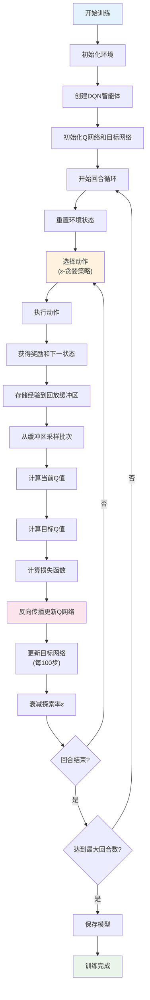
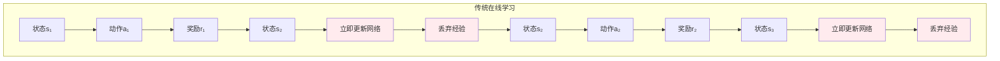
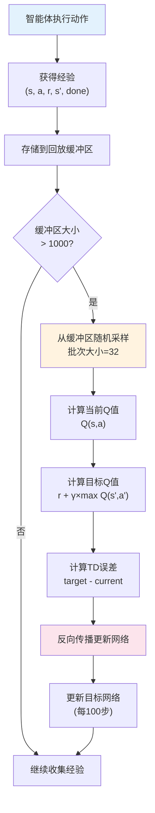

# 第2章 第2课：深度Q网络 (DQN) 算法

## 课程概述

本课程将学习深度Q网络（Deep Q-Network, DQN）算法，这是强化学习领域的一个重要突破。DQN将深度学习与Q-Learning结合，能够处理高维状态空间，为现代强化学习奠定了基础。

## 学习目标

通过本课程，你将：

1. **理解DQN的核心思想**：神经网络如何近似Q函数
2. **掌握DQN的关键技术**：经验回放、目标网络、ε-贪婪策略
3. **实现完整的DQN算法**：从网络设计到训练循环
4. **对比DQN与传统Q-Learning**：理解各自的优缺点
5. **应用DQN解决实际问题**：在FrozenLake环境中训练智能体

## 课程内容

### 📚 理论部分

#### 1. DQN算法原理
- **问题背景**：传统Q-Learning的局限性
- **核心思想**：用神经网络近似Q函数
- **数学基础**：贝尔曼方程在深度网络中的应用

#### 2. 关键技术组件
- **经验回放 (Experience Replay)**：打破数据相关性
- **目标网络 (Target Network)**：稳定训练过程
- **ε-贪婪策略**：平衡探索与利用

#### 3. 网络架构设计
- **输入表示**：状态编码方法
- **隐藏层设计**：深度和宽度选择
- **输出层**：Q值预测

### 💻 实践部分

#### 1. 环境搭建
```bash
# 安装依赖
pip install -r requirements.txt

# 运行DQN训练
python frozenlake_dqn.py
```

#### 2. 代码结构
```
frozenlake_dqn.py     # 主程序：完整的DQN实现
DQN_README.md        # 详细技术文档
requirements.txt     # 依赖包列表
README.md           # 本课程说明
```

#### 3. 核心组件实现

**神经网络模型**：
```python
class DQNNetwork(nn.Module):
    def __init__(self, input_size, hidden_size, output_size):
        # 定义网络层
        self.input_layer = nn.Linear(input_size, hidden_size)
        self.hidden_layers = nn.ModuleList([...])
        self.output_layer = nn.Linear(hidden_size, output_size)
```

**经验回放缓冲区**：
```python
class ReplayBuffer:
    def push(self, state, action, reward, next_state, done):
        # 存储经验
    def sample(self, batch_size):
        # 随机采样批次
```

**DQN智能体**：
```python
class DQNAgent:
    def select_action(self, state, training=True):
        # ε-贪婪动作选择
    def train(self):
        # 网络训练更新
```

## 实验设计

### 🎯 实验1：基础DQN训练
- **目标**：在FrozenLake 8x8环境中训练DQN智能体
- **参数**：默认超参数设置
- **评估**：成功率、平均奖励、训练曲线

### 🎯 实验2：超参数调优
- **学习率**：0.0001, 0.001, 0.01
- **网络结构**：不同隐藏层大小
- **批次大小**：16, 32, 64

### 🎯 实验3：算法对比
- **Q-Learning vs DQN**：性能对比
- **内存使用**：空间复杂度分析
- **收敛速度**：训练效率比较

## DQN算法流程图



## 技术要点

### 🧠 神经网络设计

**网络架构**：
- 输入层：64个神经元（8×8状态空间）
- 隐藏层：128个神经元，2层
- 输出层：4个神经元（4个动作）
- 激活函数：ReLU
- 正则化：Dropout (0.1)

**DQN网络架构图**：


**状态编码**：
```python
def state_to_tensor(self, state):
    """将状态转换为one-hot张量"""
    state_tensor = torch.zeros(self.config.INPUT_SIZE, dtype=torch.float32)
    state_tensor[state] = 1.0
    return state_tensor.unsqueeze(0).to(self.device)
```

### 🎲 经验回放机制

**核心原理**：
经验回放（Experience Replay）是DQN算法的关键创新之一，它解决了在线强化学习中的几个重要问题：

1. **打破数据相关性**：连续的经验数据往往高度相关，直接用于训练会导致网络过拟合
2. **提高样本效率**：重复利用历史经验，减少环境交互次数
3. **稳定训练过程**：随机采样打破了时间序列的依赖关系

**为什么需要经验回放？**

**问题1：数据相关性**
```
传统在线学习：s₁→a₁→r₁→s₂→a₂→r₂→s₃→a₃→r₃
问题：相邻的经验高度相关，网络容易过拟合到局部模式
```

**问题2：样本效率低**
```
传统方法：每个经验只用一次就丢弃
经验回放：每个经验可以被多次使用，提高学习效率
```

**问题3：训练不稳定**
```
连续经验：可能导致梯度更新方向剧烈变化
随机采样：提供更稳定的梯度信号
```

**缓冲区管理**：
- 容量：10,000个经验
- 采样：随机批次采样
- 更新：先进先出策略

**经验回放 vs 传统在线学习对比**：

```mermaid
graph TB
    subgraph "经验回放机制"
        G1["状态s₁"] --> H1["动作a₁"]
        H1 --> I1["奖励r₁"]
        I1 --> J1["存储到缓冲区"]
        J1 --> G2["状态s₂"]
        G2 --> H2["动作a₂"]
        H2 --> I2["奖励r₂"]
        I2 --> J2["存储到缓冲区"]
        J2 --> G3["状态s₃"]
        G3 --> H3["动作a₃"]
        H3 --> I3["奖励r₃"]
        I3 --> J3["存储到缓冲区"]
        J3 --> K["随机采样批次"]
        K --> L["批量更新网络"]
        L --> M["重复使用历史经验"]
    end
    
    
    style K fill:#e8f5e8
    style L fill:#e8f5e8
    style M fill:#e8f5e8
```




**经验回放流程图**：


**具体示例**：

假设智能体在FrozenLake中执行以下序列：
```
经验1: (状态0, 动作2, 奖励0, 状态1, False)
经验2: (状态1, 动作2, 奖励0, 状态2, False)  
经验3: (状态2, 动作1, 奖励0, 状态10, False)
经验4: (状态10, 动作2, 奖励0, 状态11, False)
经验5: (状态11, 动作2, 奖励1, 状态63, True)  # 成功到达目标
```

**传统在线学习**：
- 每获得一个经验就立即更新网络
- 经验1用完就丢弃，经验2用完就丢弃...
- 问题：网络只看到局部序列，容易过拟合

**经验回放机制**：
- 所有经验都存储在缓冲区中
- 训练时随机采样批次，比如采样到：[经验1, 经验3, 经验5]
- 优势：网络看到多样化的经验组合，学习更稳定

**批次训练**：
```python
# 从回放缓冲区采样
states, actions, rewards, next_states, dones = self.replay_buffer.sample(batch_size)

# 计算当前Q值
current_q_values = self.q_network(states).gather(1, actions.unsqueeze(1))

# 计算目标Q值
with torch.no_grad():
    next_q_values = self.target_network(next_states).max(1)[0]
    target_q_values = rewards + (gamma * next_q_values * ~dones)
```

**经验回放的优势总结**：
1. **数据多样性**：随机采样提供多样化的训练数据
2. **样本效率**：每个经验可以被多次使用
3. **训练稳定**：减少梯度更新的方差
4. **打破相关性**：避免连续经验的强相关性

### 🎯 目标网络更新

**更新策略**：
- 频率：每100步更新一次
- 方法：直接复制主网络参数
- 目的：稳定训练过程

### 🔍 探索策略

**ε-贪婪策略**：
- 初始探索率：1.0 (100%随机)
- 最终探索率：0.01 (1%随机)
- 衰减率：0.995

## 性能分析

### 📊 训练指标

1. **成功率**：到达目标的回合百分比
2. **平均奖励**：最近100回合的平均奖励
3. **训练步数**：总训练步数
4. **探索率**：当前ε值

### 📈 可视化输出

- **训练曲线**：奖励和成功率变化
- **移动平均**：平滑的训练过程
- **实时监控**：训练进度显示

## 扩展学习

### 🚀 进阶主题

1. **Double DQN**：减少过估计问题
2. **Dueling DQN**：分离状态价值和优势函数
3. **Prioritized Experience Replay**：优先采样重要经验
4. **Rainbow DQN**：集成多种改进技术

### 🔧 实践项目

1. **不同环境**：CartPole, MountainCar, Atari游戏
2. **网络优化**：卷积神经网络、注意力机制
3. **超参数搜索**：自动调优算法
4. **分布式训练**：多智能体学习

## 常见问题

### ❓ Q: DQN为什么需要经验回放？
**A**: 经验回放打破了连续经验之间的相关性，使训练更加稳定。同时，重复利用历史经验提高了样本效率。

### ❓ Q: 目标网络的作用是什么？
**A**: 目标网络提供了稳定的目标值，避免了训练过程中的"移动目标"问题，使学习更加稳定。

### ❓ Q: 如何选择合适的网络结构？
**A**: 网络结构需要平衡表达能力和训练效率。通常从简单结构开始，根据性能逐步增加复杂度。

### ❓ Q: DQN训练不收敛怎么办？
**A**: 检查学习率设置、网络初始化、奖励函数设计，以及探索策略的调整。

## 参考资料

- [DQN原始论文](https://arxiv.org/abs/1312.5602): Human-level control through deep reinforcement learning
- [PyTorch官方教程](https://pytorch.org/tutorials/): 深度学习框架使用指南
- [强化学习基础](https://spinningup.openai.com/): OpenAI的强化学习教程
- [Gymnasium文档](https://gymnasium.farama.org/): 强化学习环境库

## 课程总结

通过本课程的学习，你将：

✅ **掌握DQN算法的核心原理和实现**  
✅ **理解深度强化学习的基本思想**  
✅ **具备解决复杂强化学习问题的能力**  
✅ **为学习更高级的强化学习算法打下基础**  

继续学习下一课，我们将探索更高级的深度强化学习算法！
